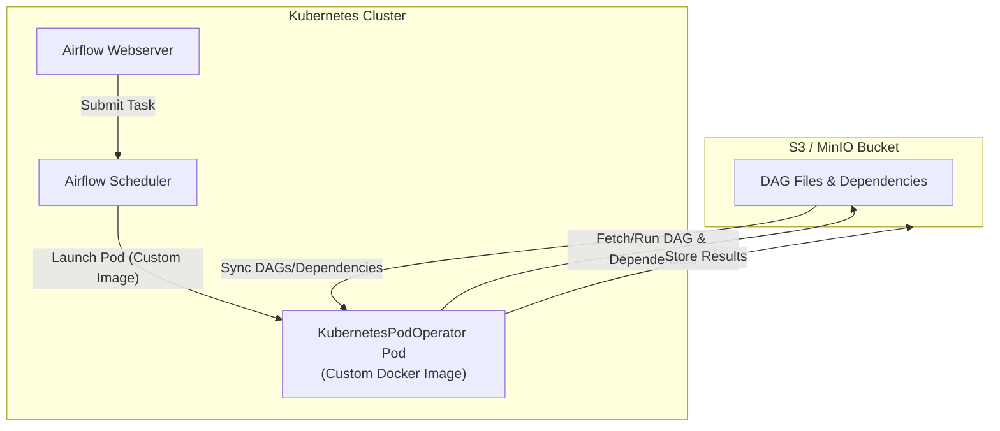

# Using a Custom Docker Image with Airflow KubernetesPodOperator

Below is a diagram that explains how to use your own custom Docker image in place of the default Anaconda image in the Airflow KubernetesPodOperator. This shows the flow from Airflow scheduling a task, launching a pod with your image, and interacting with S3/MinIO for dependencies and results.

## How the Image Can Be Customized for Different Pipeline Executions

- **Base Image**: Start from a base image (e.g., Python, Conda, or any OS) and add only the tools, libraries, and runtimes needed for your pipeline.
- **Install Dependencies**: Add Python/R/Java libraries, CLI tools, or system packages required by your pipeline code. For example, if your pipeline needs TensorFlow, install it in the Dockerfile.
- **Custom Utilities**: Add scripts, configuration files, or utilities that your pipeline tasks require.
- **Environment Variables**: Set environment variables for credentials, configuration, or runtime options.
- **Entrypoint/Startup Scripts**: Customize the entrypoint to run initialization logic or fetch additional resources at runtime.
- **Credentials**: Ensure the image has the necessary credentials (via environment variables, mounted secrets, or IAM roles) to access S3/MinIO and other resources.

## Example Scenarios

- **Simple Python Pipeline**: Image contains Python, pip, and only the libraries needed for the DAG code fetched from S3.
- **ML Pipeline**: Image includes Python, Jupyter, ML libraries (TensorFlow, PyTorch), and any data science tools needed by the pipeline code.
- **Data Processing Pipeline**: Image has Spark, Hadoop CLI, or other big data tools, plus the code that Airflow fetches from S3.
- **Custom Binaries**: If your pipeline needs custom binaries or compiled code, add them to the image.

## How It Works in Practice

1. **Airflow Scheduler** launches a KubernetesPodOperator task, specifying your custom image.
2. **Kubernetes** starts a pod using your image.
3. The pod fetches pipeline code and dependencies from S3/MinIO (or they are already present if synced/mounted).
4. The code runs inside the pod, using all the tools and libraries you included in the image.
5. Results, logs, or outputs can be written back to S3/MinIO or other destinations.

> **Tip:** The more generic your image, the more types of pipelines it can support. For highly specialized pipelines, create dedicated images with only the required tools for efficiency and security.

## How to Use Your Custom Image

1. **Build and Push Your Image:**
   - Build your Docker image with all required dependencies and push it to a registry accessible by your Kubernetes cluster.
2. **Update the DAG:**
   - In your DAG file (e.g., `cost-of-living-0520173938.py`), set the `image` parameter of `KubernetesPodOperator` to your custom image name (e.g., `myrepo/my-custom-image:tag`).
3. **Deploy and Run:**
   - Airflow will launch pods using your image, which will fetch DAG files and dependencies from S3/MinIO and execute the workflow as shown above.

> **Tip:** Ensure your custom image has all runtime dependencies and credentials needed to access S3/MinIO.