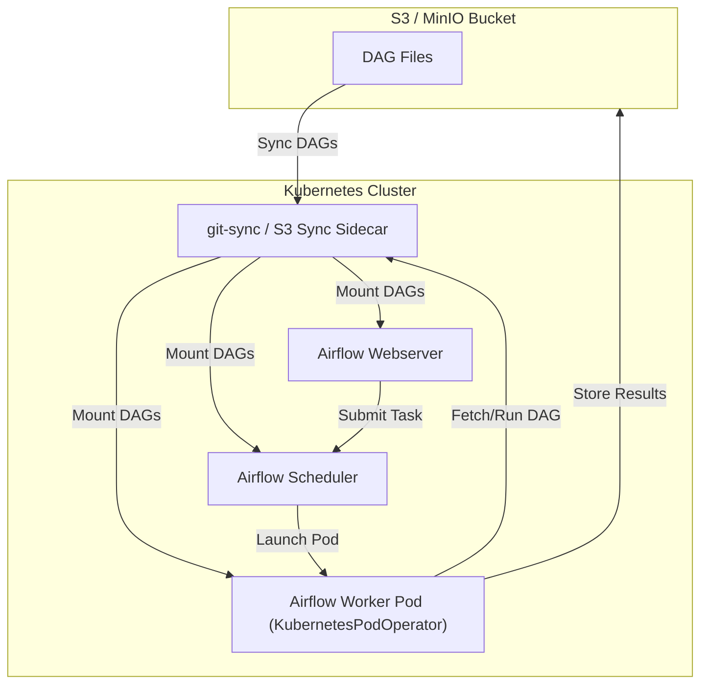

# Airflow Kubernetes Operator with S3 DAG Storage: Architecture Diagram

Below is a diagram that illustrates how the Airflow Kubernetes Operator works in conjunction with S3 (or MinIO) to fetch DAG files:

## Explanation
- **S3/MinIO**: Stores all DAG files centrally.
- **git-sync/S3 Sync Sidecar**: A sidecar container (or init container) in each Airflow component pod that syncs DAG files from S3 to a shared volume.
- **Airflow Webserver/Scheduler/Worker**: All mount the shared volume with up-to-date DAGs.
- **KubernetesPodOperator**: Launches worker pods that also mount the DAGs volume, ensuring they have the latest DAG definitions.
- **Results**: Workers can write results or logs back to S3 if needed.

This setup ensures that all Airflow components always have the latest DAGs from S3, and tasks can share data via S3 or MinIO.